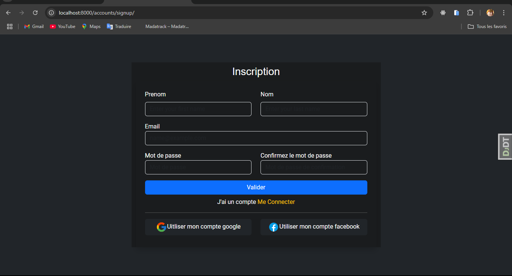
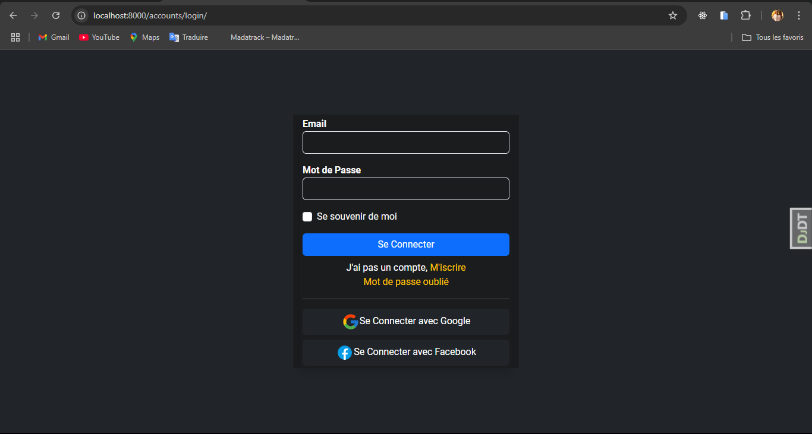
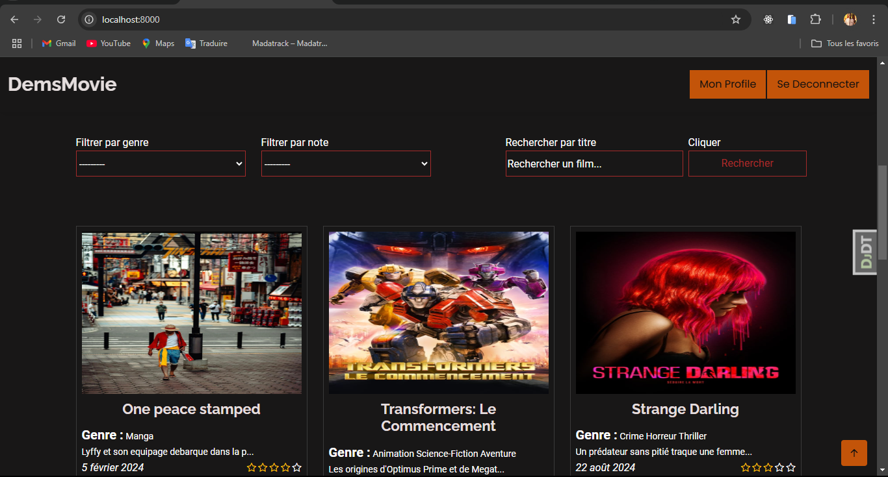
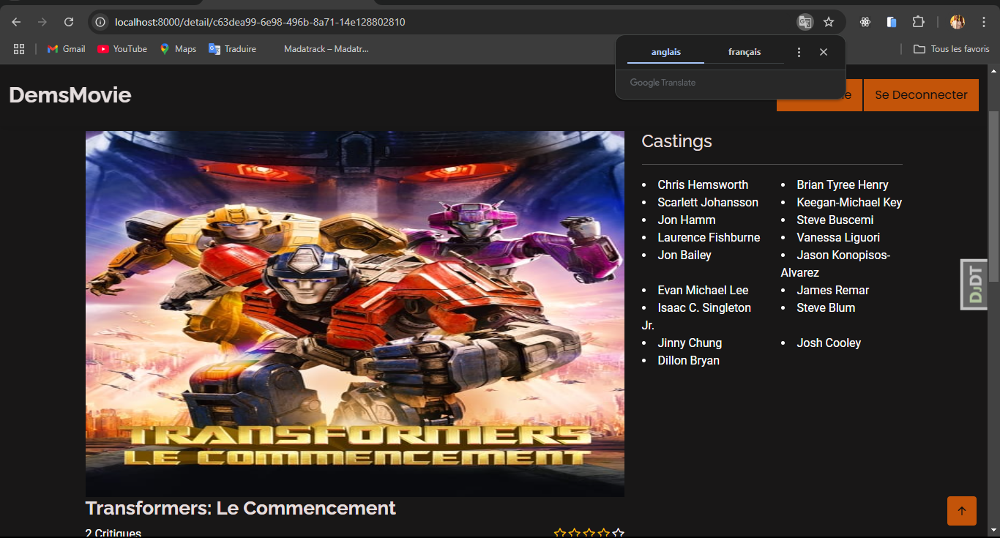
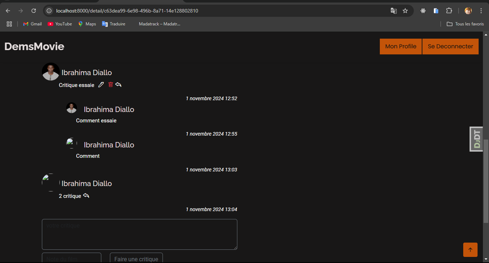

# 04_movie_review
# Movie Review

Movie Review est une application Django permettant aux utilisateurs de consulter, ajouter et évaluer des films. Le projet offre une interface où les utilisateurs peuvent poster des critiques, commenter des films, et gérer leurs profils.

## Fonctionnalités

- **Création et gestion de compte** : Les utilisateurs peuvent s'inscrire, se connecter, et mettre à jour leurs profils.


- **Gestion des films** : Les utilisateurs peuvent consulter une liste de films et trier les films par genre, année de sortie et note moyenne.
.png)


- **Critiques et commentaires** : Les utilisateurs peuvent ajouter des critiques et des commentaires pour chaque film.




- **Système de notation** : Les utilisateurs peuvent attribuer une note aux films et voir la note moyenne.

- **Système de notation** : Une api pour toutes ces fonctionnalites accessible via:
[API Swagger UI](http://127.0.0.1:8000/api/redoc/)

## Prérequis

Avant de commencer, assurez-vous d'avoir les prérequis suivants installés :

- Python 3.x
- Django 5.1.1 ou version supérieure
- pip (pour installer les dépendances)

## Installation

1. Clonez le dépôt :

    ```bash
    git clone https://github.com/ibdems/04_movie_review
    ```

2. Accédez au dossier du projet :

    ```bash
    cd 04_movie_review
    ```

3. Créez un environnement virtuel :

    ```bash
    python -m venv venv
    ```

4. Activez l'environnement virtuel :
    - Sur Windows :

    ```bash
    venv\Scripts\activate
    ```
    - Sur macOS/Linux :

    ```bash
    source venv/bin/activate
    ```

5. Installez les dépendances :

    ```bash
    pip install -r requirements.txt
    ```

6. Appliquez les migrations pour créer la base de données :

    ```bash
    python manage.py migrate
    ```

7. Créez un superutilisateur pour accéder à l'administration Django :

    ```bash
    python manage.py createsuperuser
    ```

8. Démarrez le serveur de développement :

    ```bash
    python manage.py runserver
    ```


